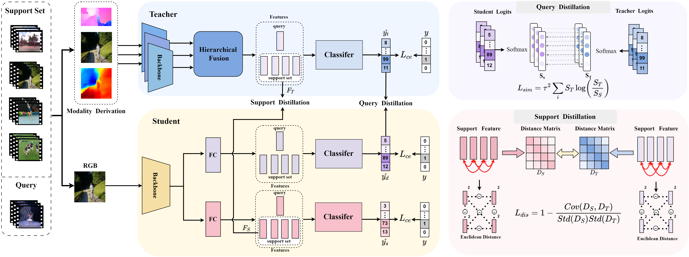
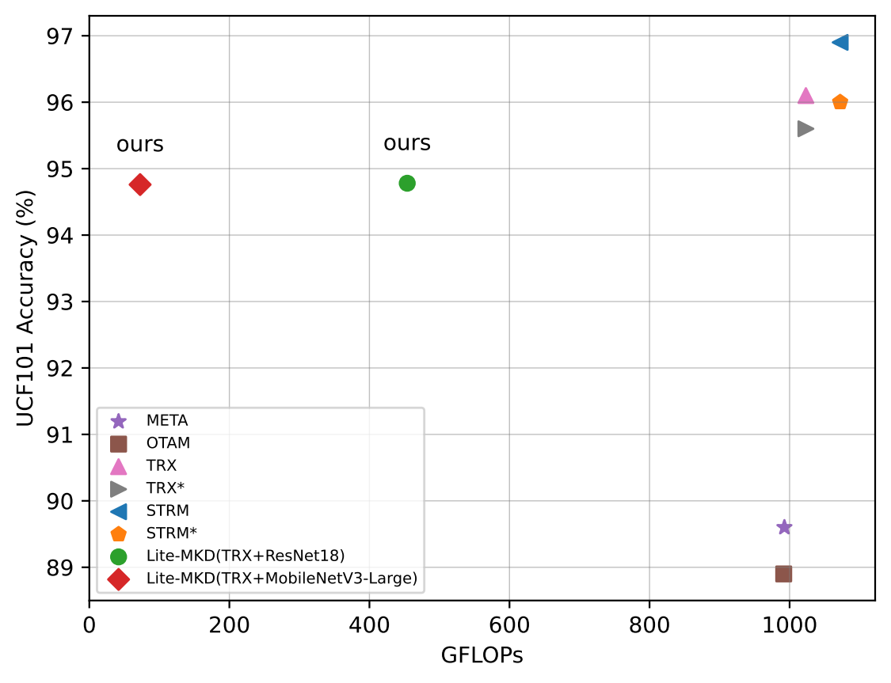

# 1 Lite-MKD: A Multi-modal Knowledge Distillation Framework for Lightweight Few-shot Action Recognition
---

Source code of our ACM MM'2023 paper  [Lite-MKD: A Multi-modal Knowledge Distillation Framework for Lightweight Few-shot Action Recognition](https://dl.acm.org/doi/10.1145/3581783.3612279)



The figure above shows the framework method of our model.Lite-MKD adopts a multi-modal teacher knowledge learning and single-modal student knowledge distillation architecture. For the input RGB videos of the query and the support set, a modality derivation step is conducted in advance to extract the multi-modal features based on the RGB videos, the extracted multi-modal features (Optical flow, RGB and depth) are then sent to the teacher model for multi-modal learning and action classification. The MFM module is responsible for hierarchical fusion of multi-modal features. The D2M is configured to help the student to mimic the multi-modal knowledge of the teacher model. The knowledge distillation between the teacher model and the student model is multi-level,namely, performed at the support level and the query level. 

 
# 2 Requirements
   
Use the following instructions to create the corresponding conda environment. 

```
conda create -n litemkd python=3.7.7 anaconda
conda activate litemkd
conda install pytorch==1.13.0 
pip3 install wandb
```
and you can also build a conda environment using the requirements given in environment.yaml.

# 3 Data Preparation
##  3.1 Data Set Preparation
Lite-MKD" has been validated on three datasets, namely "UCF101", "HMDB51", and "Kinetics". You need to prepare these three datasets and sample every video randomly for eight frames.

The data we provide is here:
[UCF](https://pan.baidu.com/s/1dUl1-98bjhpvipVejIqSlQ?pwd=8888)
[Kinetics](https://pan.baidu.com/s/1B0N_oSnQL6J-R9uYrJ3FCw?pwd=8888 )
[HMDB](https://pan.baidu.com/s/1FSWKVAduiaVAYTUvSFmyNA?pwd=8888)

##  3.2 Modal derivative

Before using Lite-MKD, you need to obtain multi-modal features of the relevant dataset.

Through the expert network, we obtained multi-modal features of RGB images in the original dataset. The specific processing method is described in the paper.

For optical flow mode, we use [FlowNet2](https://github.com/shariqfarooq123/AdaBins)
For depth mode, we use [AdaBins](https://github.com/NVIDIA/flownet2-pytorch) 
For skeleton mode, we use [alphapose](https://github.com/MVIG-SJTU/AlphaPose) 


## 3.3 The teacher training and features

We also provide extracted teacher fusion features [Feature](https://pan.baidu.com/s/1DzV_adv8q_zPOd31IuZWVA?pwd=8888)
and the teacher model [model](https://pan.baidu.com/s/1DXZ6lwGCrJIF6sNvjc3iiA?pwd=8888 )

The specific teacher model code and feature extraction steps are shown in [teacher](teacher/readme.md)

There are mainly three steps to processing our dataset. 
1. Get the raw video frames.
2. Get the Teacher model
3. Get the Teacher Features from Teacher model
   
## 3.4 File Structure

Download the above data and save to ./data folder.

Here is the directory structure of the data set for the student model. You need to place the dataset under the "data" directory, with each dataset having the following files: "feature", "l8", and "splits". The "feature" directory contains two sub-directories: "mm_feature" and "rgb_feature", which are used for the distillation of "Lite-MKD" and "Baseline", respectively. Each video's feature is extracted from an "npy" file by the teacher model. The "l8" directory contains the original frames of each dataset, which are extracted randomly from each video. The "splits" directory contains the partitioning of each dataset.
  
```
data
├─hmdb
│  ├─feature
│  │  ├─mm_features
│  │  │  └─class01
│  │  │      └─video01
│  │  │      └─ .......
│  │  └─rgb_features
│  │      └─class01
│  │          └─video01
│  │          └─ ......
│  ├─l8
│  │  ├─class01
│  │  │  ├─video01
│  │  │  └─video02
│  │  │  └─ .......
│  │  └─class02
│  │      ├─video01
│  │      └─video02
│  │      └─ .......
│  ├─splits
│  │  └─hmdb_ARN
│  └─teacher_model
├─kinetics
│  ├─feature
│  │  ├─mm_features
│  │  │  └─class01
│  │  │      └─video01
│  │  └─rgb_features
│  │      └─class01
│  │          └─video01
│  ├─l8
│  │  ├─class01
│  │  │  ├─video01
│  │  │  └─video02
│  │  └─class02
│  │      ├─video01
│  │      └─video02
│  ├─splits
│  │  └─kineticsTrainTestlist
│  └─teacher_model
└─ucf
    ├─feature
    │  ├─mm_features
    │  │  └─class01
    │  │      └─video01
    │  └─rgb_features
    │      └─class01
    │          └─video01
    ├─l8
    │  ├─class01
    │  │  ├─video01
    │  │  └─video02
    │  └─class02
    │      ├─video01
    │      └─video02
    ├─splits
    │  └─ucf_ARN
    └─teacher_model
 ```

# 4 Pretraining and Evaluation

We have provided sh scripts for both testing and training. You can modify the corresponding parameters to perform different experimental settings. If you want to train the model, you can uses given in [train_wandb.sh](train_wandb.sh) script, and if you want to test the model, you can use [test.sh](test.sh) script.

```
sh train_wandb.sh
sh test.sh
```

We release several pretrained models:
- Lite-MKD-resnet18 on ucf
- Lite-MKD-resnet18 on kinetics
- Lite-MKD-resnet18 on hmdb

| **Backbone**    | **Distillation**  | **Kinetics** | **UCF101** | **HMDB51** |
| ------------- | --------------| ---------|----------|---------|
|  ResNet18       | -           |  80.50      |  92.28    |  70.60    |
|  ResNet18        | Lite-MKD        |  **84.04**     |   **94.78**     |  **74.65**  |
| MobileNetV3-small        | -           |   74.32    |88.18    |64.47   |
| MobileNetV3-small        |Lite-MKD        |**80.27**    | **93.31**      | **71.72**  |
|MobileNetV3-large        |   -           | 78.55     | 90.34    | 65.85  |
|MobileNetV3-large          | Lite-MKD       | **83.25**    | **94.76**     | **73.95**   |


## Visualization

We use Thop library to measure the efficiency of the model. 

 

 Performance comparison of our proposed Lite-MKD with previous works (META, OTAM, TRX,and STRM) on UCF101 dataset in terms of accuracyand FLOPs. Our method achieves the best balance betweenmodel performance and complexity. Applying Lite-MKD
(TRX+MobileNetV3-large) reduces the computational complexity of the TRX by 92.91% (from 1023.3 GFLOPs to 72.6GFLOPs) while sacrificing only 1.34 points of accuracy (from96.1% to 94.76%). TRX* and STRM* represent our own reproduction results using officially released source code.

# Citation
If you find this repository useful, please consider citing our paper:

```
@inproceedings{litemkd2023,
  title={Lite-MKD: A Multi-modal Knowledge Distillation Framework for Lightweight Few-shot Action Recognition},
  author={Baolong Liu and Tianyi Zheng and Peng Zheng and Daizong Liu and Xiaoye Qu and Junyu Gao and Jianfeng Dong and Xun Wang},
  booktitle={Proceedings of the 31st ACM International Conference on Multimedia},
  year={2023}
}

```


