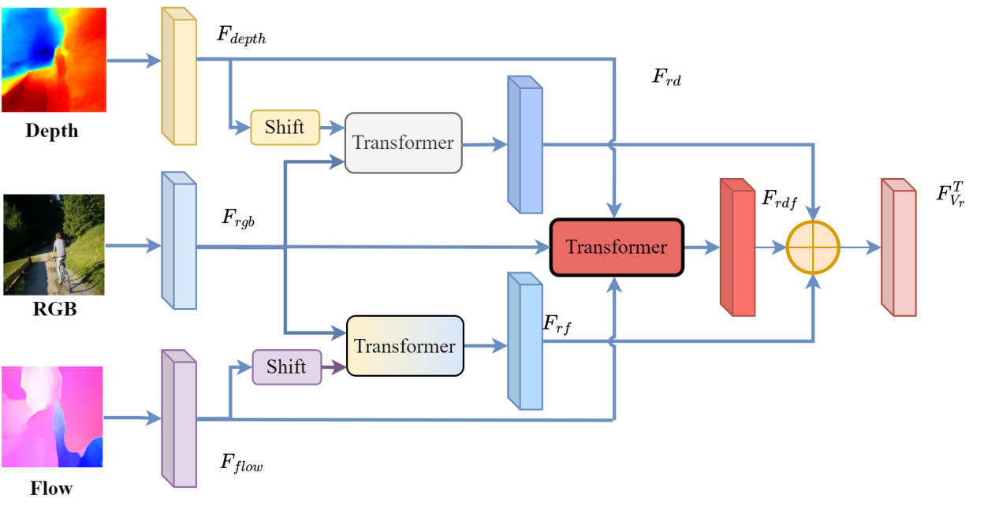

# 1. Multimodal Teacher Model
---
<center>
    
</center>

The architecture of our proposed hierarchical multi-model fusion module (MFM)

# 2 Requirements
   
Use the following instructions to create the corresponding conda environment. 

```
conda create -n mfm python=3.8.0 anaconda
conda activate mfm
conda install pytorch==1.13.0 
```
and you can also build a conda environment using the requirements given in environment.yaml.


# 3 Data Preparation
As before, you need to first obtain the original dataset and perform frame extraction, then generate derived modal data through an expert network, and place the above data in the **imp_datasets** folder according to the following structure

The data we provided that has already undergone frame extraction
[UCF](https://pan.baidu.com/s/1dUl1-98bjhpvipVejIqSlQ?pwd=8888)
[Kinetics](https://pan.baidu.com/s/1B0N_oSnQL6J-R9uYrJ3FCw?pwd=8888 )
[HMDB](https://pan.baidu.com/s/1FSWKVAduiaVAYTUvSFmyNA?pwd=8888)
The derived modal data we provide
[Feature](https://pan.baidu.com/s/1DzV_adv8q_zPOd31IuZWVA?pwd=8888)

```
imp_datasets/
└── video_datasets
    ├── data
    │   ├── hmdb
    │   │   ├── depth_l8
    │   │   ├── flow_l8 
    │   │   ├── rgb_l8 
    │   ├── hmdb_resnet50_feature
    │   │   ├── depth
    │   │   ├── flow
    │   │   └── rgb
    │   ├── kinetics
    │   │   ├── depth_l8
    │   │   ├── flow_l8 
    │   │   ├── rgb_l8 
    │   │   ├── skeleton_l8 
    │   ├── kinetics_resnet50_feature
    │   │   ├── depth
    │   │   ├── flow
    │   │   ├── rgb
    │   ├── ucf
    │   │   ├── depth_l8
    │   │   ├── flow_l8
    │   │   ├── rgb_l8 
    │   └── ucf_resnet50_feature
    │       ├── depth
    │       ├── flow
    │       ├── rgb
    └── splits
        ├── hmdb51TrainTestlist
        │   ├── testlist03.txt
        │   └── trainlist03.txt
        ├── kineticsTrainTestlist
        │   ├── testlist03.txt
        │   ├── trainlist03.txt
        │   └── vallist03.txt
        └── ucfTrainTestlist
            ├── testlist03.txt
            ├── trainlist03.txt
            └── vallist03.txt
```

# 4 Pretraining and Evaluation

We have provided sh scripts for both testing and training. You can modify the corresponding parameters to perform different experimental settings. If you want to train the model, you can uses given in [multi_fusion_r+d+f.sh](scripts/ucf/multi_fusion_r+d+f.sh) script, and if you want to test the model, you can use [test.sh](test.sh) script.

```
sh scripts/ucf/multi_fusion_r+d+f.sh
sh scripts/hmdb/multi_fusion_r+d+f.sh
sh scripts/kinetics/multi_fusion_r+d+f.sh
sh test.sh
```

# Citation
If you find this repository useful, please consider citing our paper:

```
@inproceedings{litemkd2023,
  title={Lite-MKD: A Multi-modal Knowledge Distillation Framework for Lightweight Few-shot Action Recognition},
  author={Baolong Liu and Tianyi Zheng and Peng Zheng and Daizong Liu and Xiaoye Qu and Junyu Gao and Jianfeng Dong and Xun Wang},
  booktitle={Proceedings of the 31st ACM International Conference on Multimedia},
  year={2023}
}

```